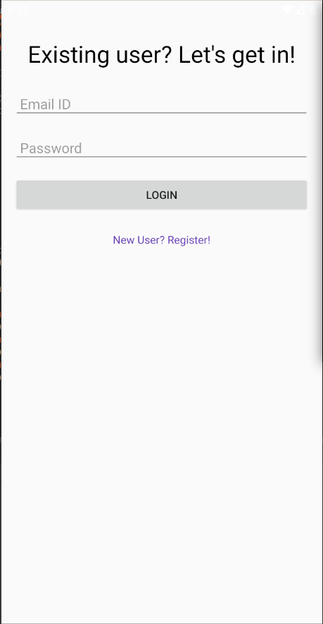
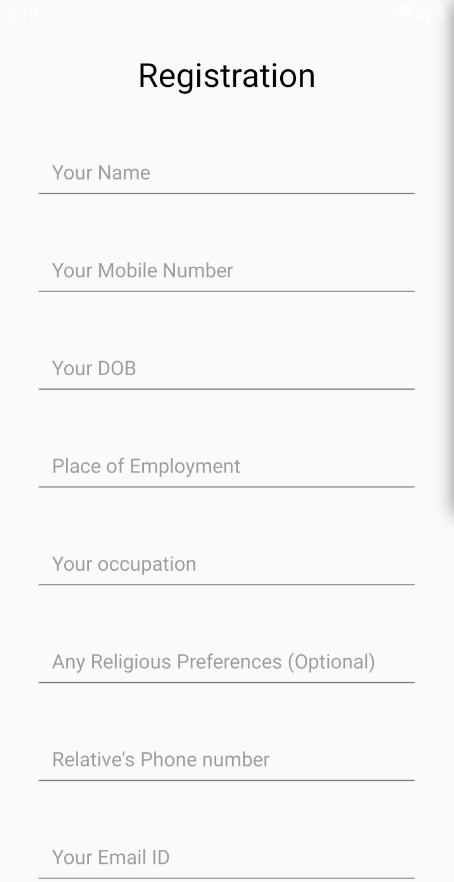
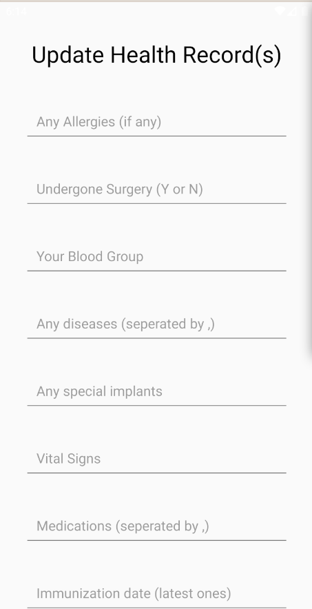
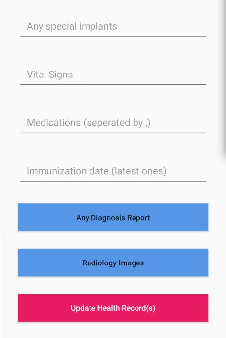

# Project for IBM Call For Code 2019

An android application which is developed to take the health information of the users and when a disaster strikes in their locality, this application helps to get their treatment based on their health information which can be accessed faster through their smartphone itself.

👍 Comments and new issues created are welcomed.

### Background

Being a team of three compassionate developers, we wanted to work for the society and helping people whenever required through our skills and the open-source technologies available. 

And one day, we got to know about the IBM's love for society through their biggest attempt to save human lives through technology by conducting a Hackathon called "IBM Call For Code" and we loved their attempt and we started working for that and the result is the above code which was made with our passion and our mission of helping people and getting their things get done.

### What does this do?
* This is an attempt to help people to survive in a natural disaster.
* This android application initially asks for their personal information and this is just a one-time-process
* Next, the health information of the users is collected periodically and this is to ensure their information is updated and when a disaster occurs, that should help doctors to give treatment to that users accurately.

### Screenshots

### License
Guage governing permissions and limitations under
the License.
