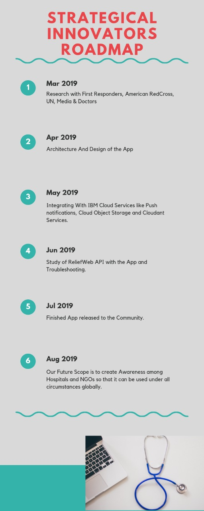

# Project for IBM Call For Code 2019: Electronic Medical Records Maintenance System

An android application which is developed to take the health information of the users and when a disaster strikes in their locality, this application helps to get their treatment based on their health information which can be accessed faster through their smartphone itself.

👍 Comments and new issues created are welcomed.

### Introduction

Imagine a case where you have been to an emergency, the doctors have said that there's heavy bleeding, blood has to be pumped into the patient ASAP. If the patient is conscious then we won't have any issues with that. The patient will give us the relevant information like Blood Group, previous medical history, and current Medication that he's taking. But in most cases, it's not quite so. The patient is unconscious and we need to take some precious time out of the ticking down life equation of the patient and to do the tests.
Imagine a world where we get to maintain the records of patients online. Won't that add some precious minutes to the patient's life equation?

It is very essential for a doctor to know the Medical History of the Patient before starting the general procedures. In some emergency cases where there is excess loss of blood due to an accident, the doctor has to pump fresh blood into the patient's body, but what can he do if he doesn't even know the blood group of the patient. In such cases, Electronic Health Record (EHR) comes in handy. It is a medical record of all the patients in the region. Whenever a disaster strikes, we get an early warning with the technology we have today and the EHR's of the particular region are downloaded to the patient's mobiles before the communication lines fail. Doctors can then go through the details of the patients by looking at them.
 
This helps doctors in writing a comprehensive prescription taking into consideration all the patient's previous medication so that there are no side-effects because of that. Take the case of Asthma, Beta-blockers which aid the patients suffering from Cardiac-arrest worsen the situation for people with Asthma. So what if the Doctor had no prior knowledge of the patient's medical history and had given him that drug. He could have been dead. So this Highlights how important maintaining of medical records is. 

### What does this do?

* This is an attempt to help people to survive in a natural disaster.
* This android application initially asks for their personal information and this is just a one-time-process
* Next, the health information of the users is collected periodically and this is to ensure their information is updated and when a disaster occurs, that should help doctors to give treatment to that users accurately

### Working

In our mobile app, we are collecting the medical history of patients from their mobile. First, they get the Login/Signup Page when they open the App. After the user gets logged-in, he is asked to fill in the primary details like Name, Email & Unique ID, etc. Then he has to enter the medical history of allergies, current suffering diseases, etc that he is facing. We are storing this data online by using IBM Cloudant which is a NoSQL Database. To synchronize the data we are using Push Replicator, so the user can update the latest details with ease. And in case of disaster, we are taking the help of ReliefWeb API which tells us the information about the disaster. We extract the location value from the JSON object which is sent from ReliefWeb. After finding out the location all that's left to be done is to warn the users in that particular region about the event which is about to happen by sending notifications. Also, we will download all the medical history of the users so they can access it offline.

### Technologies used

IBM Services that we are using are: 
Push notifications,
Cloud Object Storage,
Cloudant Services.

### Screenshots

### Roadmap

### License
Guage governing permissions and limitations under
the License.

We hope that our App brings awareness into the Medical field and reciprocates the Safety & Wellbeing of People.
